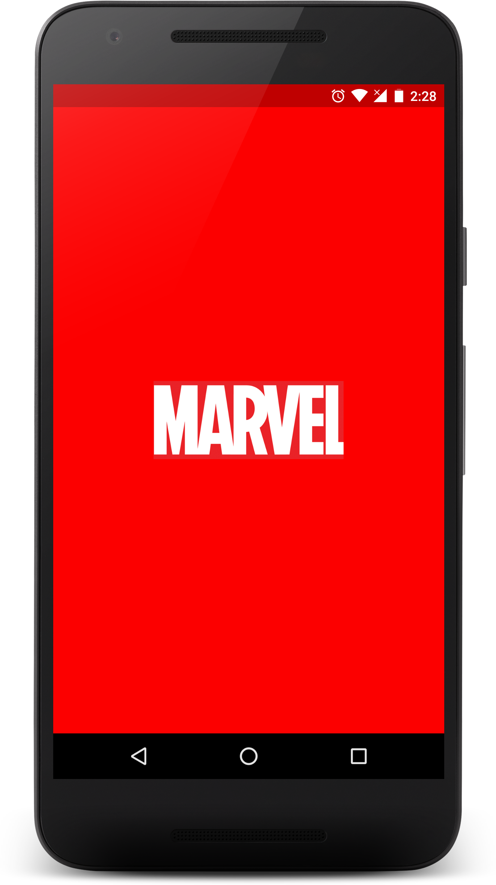
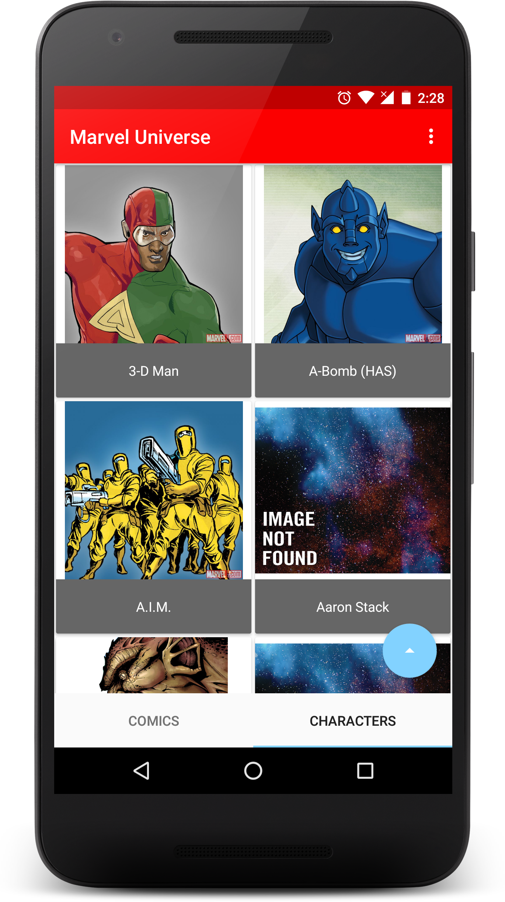
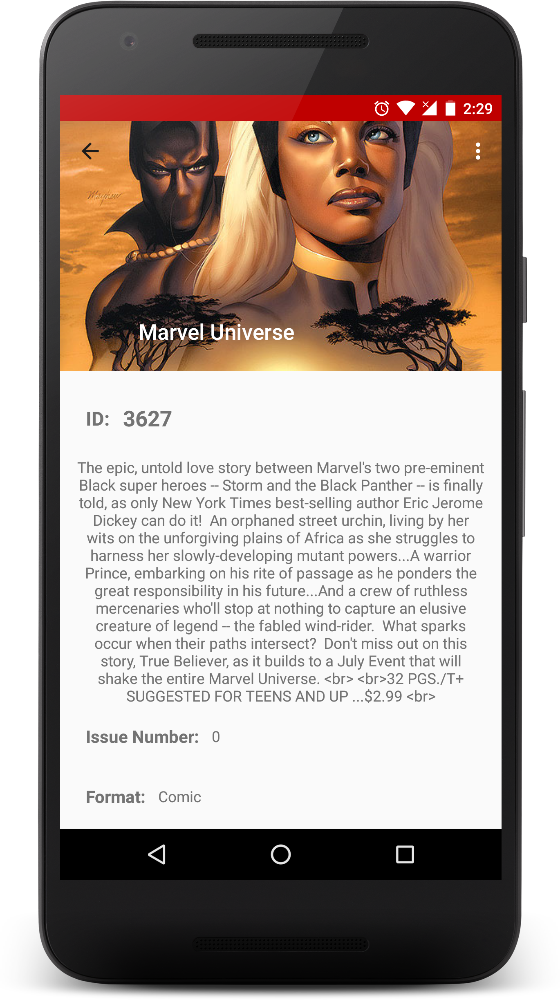

# [Marvel Universe](/screenshots/marvel.apk)

 A simple content browsing app created using [Marvel API](https://developer.marvel.com/)

## Structure

- Splash activity to load data on first load
- A main screen with 2 tabs, one for Comics other for Characters
- Comics tab lazy loads all the comics in marvel database
- Characters tab to do the the same for characters
- ContentProvider for storing data in a SQLite Database

## Libraries used

- Volley for HTTP requests
- Picasso for image loading
- Stetho: Debug bridge
- LeakCanary for memory leak detection
- ButterKnife for view-binding
- RecyclerView and CardView

## Screenshots

    
    
    

